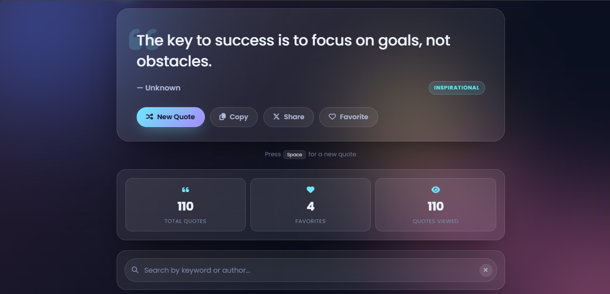

# 💬 Random Quote Generator

A modern and responsive **Random Quote Generator** built using **HTML, CSS, and JavaScript**. It displays a random inspirational quote on page load and every time the user clicks the **New Quote** button.

This project was developed as **Task 2** for the **CodeAlpha Web Development Internship**.

---

## ✨ Features

- 🎲 Random quote on page load
- 🔄 New Quote button
- 👤 Quote with author name
- ❤️ Add/Remove Favorites
- 📋 Copy quote to clipboard
- 📤 Share quote on X (Twitter)
- 🌙 Dark/Light Mode
- 🔍 Search quotes
- 📊 Quote statistics
- 💾 Local Storage support
- 📱 Fully Responsive Design
- 🎨 Modern Glassmorphism UI

---

## 🛠️ Technologies Used

- HTML5
- CSS3
- JavaScript (ES6)
- Font Awesome
- Google Fonts (Poppins)
- Local Storage API

---

## 📂 Project Structure

```
Random-Quote-Generator/
│── index.html
│── style.css
│── script.js
│── quotes.js
│── README.md
```

---

## 🚀 How to Run

1. Download or clone this repository.
2. Open `index.html` in your browser.
3. Click **New Quote** to generate random quotes.

---

## 🌐 Live Demo

**GitHub Pages:**  
https://husnainraza313.github.io/Random-Quote-Generator/

---

## 📸 Screenshot




---

## 👨‍💻 Developer

**Muhammad Husnain Raza**

- 🎓 ADP Computer Science Student
- 🏫 Bahria University Lahore
- 💼 CodeAlpha Web Development Intern

**GitHub:**  
https://github.com/HusnainRaza313

**LinkedIn:**  
(https://www.linkedin.com/in/muhammad-husnain-raza-523266304)

---

## 📄 License

This project is licensed under the **MIT License**.

---

⭐ If you like this project, don't forget to **star this repository**!
